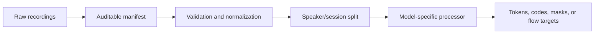

# Data preparation

There is no universal TTS batch. VoiceHub keeps source records simple, then
delegates semantic target construction to the selected model's dataset,
processor, collator, or specialized training adapter.

<div class="vh-flow-diagram" role="region" aria-label="Scrollable data preparation workflow diagram" tabindex="0" markdown>



</div>

## Start with an auditable manifest

JSON Lines keeps each source utterance independent of transient tensors:

```json
{"id":"speaker01-session01-0001","text":"[S1] This transcript matches the recording.","audio":"audio/speaker01-session01-0001.wav","speaker_id":"speaker01","session_id":"session01","language":"en","consent":true,"license":"owned"}
{"id":"speaker01-session02-0001","text":"[S1] Validation uses a different session.","audio":"audio/speaker01-session02-0001.wav","speaker_id":"speaker01","session_id":"session02","language":"en","consent":true,"license":"owned"}
```

Recommended source fields:

| Field                | Purpose                                                        |
| -------------------- | -------------------------------------------------------------- |
| `id`                 | Stable utterance identifier                                    |
| `text`               | Exact spoken transcript, including model-specific speaker tags |
| `audio`              | Path relative to the manifest, or an absolute local path       |
| `speaker_id`         | Speaker-disjoint evaluation and conditioning                   |
| `session_id`         | Prevent adjacent takes from leaking across splits              |
| `language`           | Filtering, balancing, and language-conditioned models          |
| `consent`            | Authorization for the intended voice use                       |
| `license` / `source` | Provenance and redistribution constraints                      |

!!! danger "Treat voice data as sensitive"

    Train only on voices authorized for the intended use. Do not put secrets,
    access tokens, or unnecessary personally identifying notes in a manifest.
    Preserve consent and provenance with every derived dataset version.

## Resolve relative audio safely

Resolve paths relative to the manifest rather than the current working
directory:

```python
import json
from pathlib import Path


def load_jsonl(path: str | Path) -> list[dict]:
    path = Path(path)
    records = []
    with path.open(encoding="utf-8") as stream:
        for line_number, line in enumerate(stream, start=1):
            if not line.strip():
                continue
            record = json.loads(line)
            if not isinstance(record, dict):
                raise TypeError(f"{path}:{line_number} is not an object")
            audio = Path(record["audio"]).expanduser()
            if not audio.is_absolute():
                audio = path.parent / audio
            record["audio"] = str(audio.resolve())
            records.append(record)
    if not records:
        raise ValueError(f"No records found in {path}")
    return records
```

Keep raw recordings immutable. Write normalized audio and resolved split
manifests to a new, versioned prepared-data directory.

## Normalize for the selected processor

This guide uses Dia as a concrete raw-data route. The tutorial's prepared-data
policy is:

- mono;
- exactly 44,100 Hz;
- finite and non-empty; and
- aligned with the transcript.

The Dia adapter rejects unexpected sample rates. File-backed multichannel
audio is downmixed by the adapter, while in-memory waveforms must already be
mono rank-1 arrays. Enforcing mono files during preparation keeps the dataset
explicit and consistent.

```python
from pathlib import Path

import numpy as np
import soundfile as sf


def prepare_dia_audio(source: str | Path, destination: str | Path) -> Path:
    import torch
    import torchaudio

    source = Path(source)
    destination = Path(destination)
    audio, source_rate = sf.read(
        source,
        dtype="float32",
        always_2d=True,
    )
    waveform = torch.from_numpy(np.mean(audio, axis=1))
    if source_rate != 44_100:
        waveform = torchaudio.functional.resample(
            waveform,
            source_rate,
            44_100,
        )
    if waveform.numel() == 0 or not torch.isfinite(waveform).all():
        raise ValueError(f"Invalid waveform: {source}")
    destination.parent.mkdir(parents=True, exist_ok=True)
    sf.write(destination, waveform.numpy(), 44_100)
    return destination
```

Resampling does not repair clipping, background music, long silence, incorrect
transcripts, or licensing problems. Measure those separately.

## Validate the prepared records

```python
from pathlib import Path

import numpy as np
import soundfile as sf


def validate_dia_records(records: list[dict]) -> None:
    seen = set()
    for index, record in enumerate(records):
        record_id = str(record.get("id", index))
        if record_id in seen:
            raise ValueError(f"Duplicate record id: {record_id}")
        seen.add(record_id)

        if not str(record.get("text", "")).strip():
            raise ValueError(f"{record_id}: empty transcript")
        if record.get("consent") is not True:
            raise ValueError(f"{record_id}: consent is not recorded")

        audio_path = Path(record["audio"])
        if not audio_path.is_file():
            raise FileNotFoundError(f"{record_id}: {audio_path}")

        info = sf.info(audio_path)
        if info.channels != 1 or info.samplerate != 44_100:
            raise ValueError(
                f"{record_id}: expected mono 44100 Hz, received "
                f"{info.channels} channel(s) at {info.samplerate} Hz"
            )

        samples, _ = sf.read(
            audio_path,
            dtype="float32",
            always_2d=False,
        )
        if samples.size == 0 or not np.isfinite(samples).all():
            raise ValueError(f"{record_id}: audio is empty or non-finite")
```

Add project-specific checks for duration limits, signal-to-noise ratio,
clipping, loudness, transcript normalization, language, speaker balance, and
duplicate content.

## Split by speaker or session

Randomly splitting adjacent clips leaks room tone, microphone response,
background noise, and neighboring takes into validation. Group by speaker or
recording session:

```python
import random


def grouped_split(
    records: list[dict],
    *,
    group_key: str = "session_id",
    validation_fraction: float = 0.1,
    seed: int = 42,
) -> tuple[list[dict], list[dict]]:
    if not 0.0 < validation_fraction < 1.0:
        raise ValueError("validation_fraction must be between 0 and 1")

    groups = {}
    for record in records:
        group = record.get(group_key)
        if group is None:
            raise ValueError(f"Every record requires {group_key!r}")
        groups.setdefault(str(group), []).append(record)

    group_names = sorted(groups)
    if len(group_names) < 2:
        raise ValueError(f"At least two {group_key} groups are required")
    random.Random(seed).shuffle(group_names)

    validation_count = max(
        1,
        min(len(group_names) - 1, round(len(group_names) * validation_fraction)),
    )
    validation_groups = set(group_names[:validation_count])
    train_records = [
        record
        for record in records
        if str(record[group_key]) not in validation_groups
    ]
    validation_records = [
        record
        for record in records
        if str(record[group_key]) in validation_groups
    ]
    return train_records, validation_records
```

Persist the resulting manifests, split seed, preprocessing revision, and
content hashes.

## Use an integrated raw-data adapter

Six current integrations accept ordinary source records, but their contracts
still differ:

| Model   | Accepted source record                                                                                           |
| ------- | ---------------------------------------------------------------------------------------------------------------- |
| Dia     | Non-empty `text`; 44.1 kHz audio path or mono rank-1 audio array                                                 |
| Orpheus | `text` plus an audio path resampled to 24 kHz by the helper, or SNAC `audio_codes`; optional `voice`/`source`    |
| LLaSA   | `text` plus `audio` or XCodec2 `audio_codes`; completion-only labels                                             |
| OuteTTS | Prepared `speaker` mapping, or `audio` plus optional `text`; HF backend only                                     |
| CSM     | Conversation/messages, grouped utterances, or scalar text/audio/speaker records passed directly to `Trainer`     |
| NeuTTS  | `text` plus `audio` or NeuCodec `audio_codes`; HF backbone only                                                  |

For adapters exposing `create_training_dataset()`:

```python
train_dataset = training_model.create_training_dataset(train_records)
validation_dataset = training_model.create_training_dataset(
    validation_records
)
```

CSM is the notable exception: pass the raw records directly as
`train_dataset`, and its specialized adapter installs the lazy processor
collator.

## Inspect a model-owned batch

For Dia, the official processor creates text inputs, delayed decoder inputs,
attention masks, and masked codec labels:

```python
features = [
    train_dataset[index]
    for index in range(min(2, len(train_dataset)))
]
batch = train_dataset.collate_fn(features)

for name, value in batch.items():
    print(name, getattr(value, "shape", type(value).__name__))
```

Before a long run, confirm:

- label tensors contain trainable positions;
- masks align with their sequences;
- source audio was validated at the processor sample rate;
- codec channel and codebook order match the source implementation; and
- frozen target encoders do not receive gradients.

## Supply preprocessed tensors when required

Some integrations expose a verified objective but do not yet own raw-data
preparation. The generic collator pads structure; it does not invent semantic
targets:

```python
from voicehub import DataCollatorForTTSTraining, TTSFieldSchema

collator = DataCollatorForTTSTraining(
    field_schemas={
        "model_inputs.mel": TTSFieldSchema(
            sequence_dim=-1,
            padding_side="right",
            length_field="mel_lengths",
            mask_field="mel_mask",
            pad_to_multiple_of=8,
        ),
    },
)
```

A backend-shaped record may look like:

```python
record = {
    "model_inputs": {
        "text_tokens": text_tokens,
        "speaker_embedding": speaker_embedding,
        "mel": mel,
    },
    "labels": target,
}
```

The meanings, shapes, masks, and loss target come from the selected model
recipe—not from the generic field names.

## Preparation changes by family

| Family                  | Preparation boundary                                                                                                                  |
| ----------------------- | ------------------------------------------------------------------------------------------------------------------------------------- |
| Causal/codec LM         | Frame text and codec tokens, apply codebook delays, and mask prompt positions. Target codecs normally remain frozen.                  |
| Encoder-decoder LM      | Build encoder inputs, delayed decoder inputs, decoder masks, and teacher-forced labels through the model processor.                  |
| Flow matching/diffusion | Define clean samples, noise, sampled time, conditioning, masks, and the exact velocity or noise target expected by the source loss.   |
| VITS/GAN                | Prepare phonemes, lengths, spectrograms, waveforms, alignments, speakers/languages, and phase-specific real/fake batches.             |
| Hybrid/composite        | Prepare the union of component schemas and preserve explicit detach boundaries between independently optimized phases.                |

VoiceHub never fabricates a generic flow target or collapses a
generator/discriminator recipe into waveform regression.

## Data readiness checklist

- Consent, allowed uses, source, and license are recorded.
- Raw recordings are immutable.
- Prepared audio follows the selected processor's sample-rate and channel
  contract.
- Transcripts match the audio and preserve required speaker/control tokens.
- Train and validation groups do not share speakers or recording sessions.
- Manifest and preprocessing revisions are content-addressed.
- One collated batch has correct shapes, masks, labels, and finite values.
- Frozen codecs, vocoders, and speaker encoders are documented.

Continue with [training](training.md) once one complete batch satisfies the
selected model's contract.
