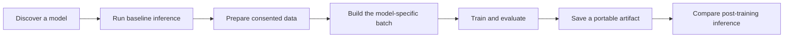

# Workflows

VoiceHub shares one public lifecycle across TTS models while keeping
architecture-specific semantics explicit. Choose a workflow below, or use the
[end-to-end Dia notebook](notebook.md)
to follow all three in sequence.

## Inference

Use the [inference guide](inference.md) to:

- discover models without importing their ML runtimes;
- load Hub checkpoints and local artifacts;
- configure deterministic generation;
- provide voice, language, style, and reference conditioning;
- consume the normalized `TTSOutput`; and
- keep serving optimizations separate from the training graph.

## Data preparation

Use the [data preparation guide](data-preparation.md) to:

- design auditable JSON Lines manifests;
- validate sample rate, channels, finite samples, transcripts, and consent;
- prevent speaker and recording-session leakage;
- understand raw-data versus preprocessed routes; and
- inspect model-owned codec, mask, and target layouts before training.

## Training

Use the [training guide](training.md) to:

- verify whether the exact model variant can be fine-tuned;
- select the differentiable checkpoint instead of GGUF or serving exports;
- run native LM, flow, VITS, GAN, and hybrid recipes;
- start with a one-step gradient smoke test;
- resume complete VoiceHub checkpoints exactly; and
- distinguish a portable inference artifact from optimizer-bearing state.

!!! warning "Training support is not universal"

    VoiceHub currently exposes a fine-tuning path for 18 of 31 integrations.
    Six accept ordinary raw records; the remaining supported routes require
    preprocessed tensors or a qualified specialized recipe. Read the
    [training support matrix](../models/training-support.md) before choosing a
    checkpoint or dataset schema.

## Artifact boundaries

| Artifact                     | Purpose                                                                  |
| ---------------------------- | ------------------------------------------------------------------------ |
| Source manifest              | Provenance, consent, transcript, speaker/session identity, and audio path |
| Prepared dataset             | Normalized audio and immutable, versioned split records                  |
| Dataset and collator         | Model-specific tokens, codes, masks, flow targets, or phase inputs       |
| `checkpoint-N/`              | Exact resume: model, optimizers, scheduler, RNG, sampler, recipe state   |
| `trainer.save_model()`       | Portable VoiceHub artifact for reload and weight warm-start              |
| `native_export/`             | Source-native export with semantics declared by the model adapter        |

A safetensors file is a weight container, not an exact training checkpoint.
GGUF, ONNX, TensorRT, JIT, vLLM, and other optimized serving artifacts are not
automatically differentiable.
